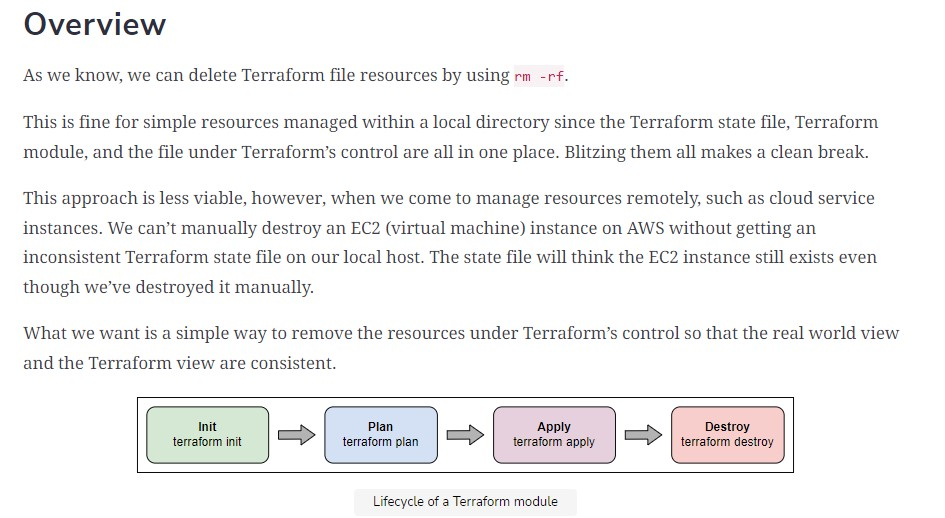
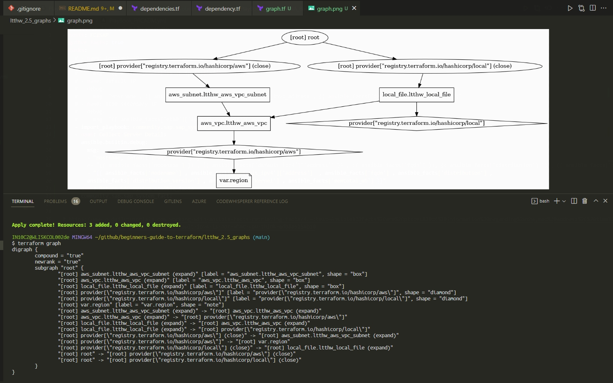
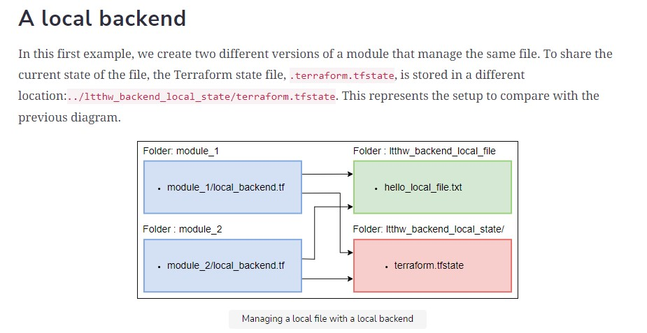
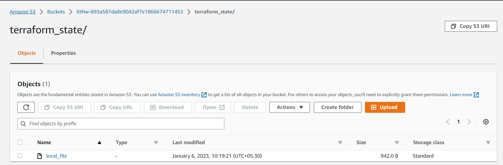
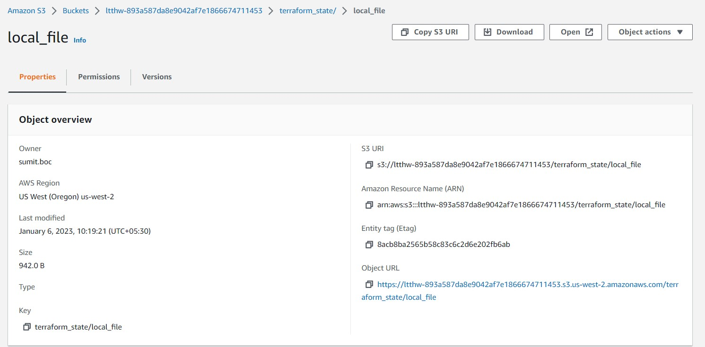

# beginners-guide-to-terraform

## beginners-guide-to-terraform via Educative.io

### Section 1.2 : Terraform 101

What was done in this section:

```bash
mkdir ltthw_resources 

echo resource "local_file" "hello_local_file" {         >    hello_local_file.tf
echo    content = "Hello terraform local!"              >>   hello_local_file.tf
echo filename =  "${path.module}/hello_local_file.txt"  >>   hello_local_file.tf
echo }                                                  >>   hello_local_file.tf

terraform init
terraform fmt
terraform validate
terraform apply
terraform apply -auto-approve
terraform plan
terraform destory
```

### Sectoin 1.5 : Terraform Module Output

1. Create a data section and a file with no contents. --> Error
2. Create a data section and a file with some contents. --> OK but no changes.
3. Create a data section and output section and a file with some contents. --> OK and changes applied and shown.

```bash
data "local_file" "data_file" {
  filename = "${path.module}/afile.txt"
}

output "data_file_content" {
  value = data.local_file.data_file.content
}
```

### Section 1.6 : Terraform Destroy

This is life cycle of teraform commands:



Created a local file resource and destroy it.

```bash
resource "local_file" "hello_destroy_file" {
  content  = "Hello terraform destroy!"
  filename = "${path.module}/hello_destroy.txt"
}
```

```bash
terraform init
terraform fmt
terraform validate
terraform apply
terraform show
terraform plan -destroy
terraform destroy
terraform show
```

### Exercise_1

Q. Print you name in terraform.

A.

<ins>myname_file.txt</ins>

```text
My name is Sumit Das.
Dark Lord of DevOps.
```

<ins>output.tf</ins>

```bash
data "local_file" "myname_data" {
  filename = "${path.module}/myname_file.txt"
}

output "myname_data-output" {
  value = data.local_file.myname_data.content
}
```

> Run the commands:

```terraform
terraform init
terraform fmt
terraform validate
terraform apply -auto-approve
terraform show
terraform plan
```

### Section 2.3 and 2.4 : Dependency

Commands used:

```bash
terraform plan -destroy -target=aws_vpc.ltthw-vpc
terraform plan -destroy -target=local_file.hello_local_file
```

### Section 2.5 : Graph

```bash
terraform graph
terraform graph > graph.dot
cat graph.dot
cat graph.dot | dot -Tpng > graph.png
```

Graph is crated like this:



### Section 2.6 : Import

Commands Used:

```python
terraform show > resources.txt
rm terraform.tfstate terraform.state.backup
terraform import aws_subnet.ltthw-vpc-subnet subnet-01c0aa6aac2b22023
terraform state list
terraform show 
terraform import aws_vpc.ltthw-vpc vpc-13a5a768
terraform state list
terraform show
terraform import local_file.hello_local_file hello_local.txt
```

### Section 3.2 : Modules

### Section 3.3 : Module Variables

Check the files in [ltthw_3.3_variable](ltthw_3.3_variable/variable_module_consumer/variable_module_consumer.tf)

Takeaway Commands:

```bash
terraform apply -var 'myfilename=command_line_filename.txt' -auto-approve 
```

### Section 3.4 : Module Output

How to access variable from another module :

```bash
output "consumer_content" {
  value = module.hello.content
}
```

### Section 3.6 : Data Types : Collection Types

Takeaway Commands:

```bash
 terraform apply -var-file="testing.tfvars"  -auto-approve
```

References:

1. [Data Types Hasicorp GitHub](https://github.com/hashicorp/terraform/blob/main/website/docs/language/expressions/types.mdx)
2. [Types and Values Learn Terraform](https://developer.hashicorp.com/terraform/language/expressions/types)

Data Types:

> If we don’t specify a type in our code for the collection and input the value on the command line while mixing types, Terraform will convert the values to a single type if it can, based on rules specified in the language.

0. **Common Data Types** :

```bash
a_number      = 2
a_string      = "SD"
a_boolean     = false
```

1. **List**     : The simplest of these is a list which looks similar to the list construct in other languages. ``` a_list        = [2, 1, 2] ```
2. **Sets**     : Unlike lists, sets do not care about ordering and dropping any duplicates within the set. ``` a_string_set  = ["Hello", "Hello", "Goodbye"] ```
3. **Maps**     : If we need to associate one variable with another, then maps are our friends. They allow us to map a string to a variable of a specifiable type.

```bash
a_string_map  = { "1" : "Hello", "2" : "Goodbye" }
a_number_map  = { "example1" : 2.2 }
a_boolean_map = { "abc" : true }
```

4. **Objects**  : Complex types allow us to collect variables of different types into a single variable.

```bash
variable rectangle { 
type = object({
    length=number, 
    width=number, 
    description=string
    }) 
}
```

5. **Tuples**   : A tuple is like a list, but it specifies the type and length of the list directly.

```bash
variable a_tuple { 
type = tuple([number,string]) 
}
```

6. **Any**      : Instead of specifying a type, we can use the any keyword to instruct Terraform to take the type of the first value it sees for the variable.

```bash
variable a_tuple_with_any { 
type = tuple([any,string]) 
}
```

### Section 4.1 : Null, Provisioners, Triggers

The null resource is a resource that explicitly does not create anything.
The provisioners set up resources upon creation or change.
The triggers allow the user to exercise some control over when provisioners are run.

### Section 4.2 : Multiple resources

#### Count

The count meta-argument looks like a simple variable, but it has a significant effect on the Terraform code. A meta-argument is a value that tells Terraform about the resources being created rather than the details of the resources themselves.

As you have probably guessed, setting count creates that number of resources. Remember that Terraform is declarative, but if we think in terms of iterative code, then this turns the code into something like a for loop. In this for loop, count.index can be used to refer to which iteration we’re currently on.

Also seen above is the format function, which allows us to format strings. If you want to learn more about it, look up the Terraform format function. In this case, the subnet for the cidr_block value for each of the three AWS VPCs created is provided.

#### For-each

For-each is an alternative way to count to make multiple instances of a resource. It could be viewed as an extension of the count, where each iteration has its own value beyond an integer.

The for_each can take either a set of strings or a map. If it’s a map, we can use the each.key reference to refer to the key of each item of the map in turn, or each.value to refer to each item’s value.

### Section 4.3 : Backend



Extract S3 bucket Name:   ``` BUCKET_NAME="$(terraform show -no-color | grep -w bucket | awk '{print $NF}')" ```

### Section 4.4 : Remote backend

When chaninging from local to rmeote backend for same resource, the following error comes up


```bash
Initializing the backend...
╷
│ Error: Backend configuration changed
│
│ A change in the backend configuration has been detected, which may require migrating existing state.
│
│ If you wish to attempt automatic migration of the state, use "terraform init -migrate-state".
│ If you wish to store the current configuration with no changes to the state, use "terraform init -reconfigure".
```

> Terraform State in AWS S3

